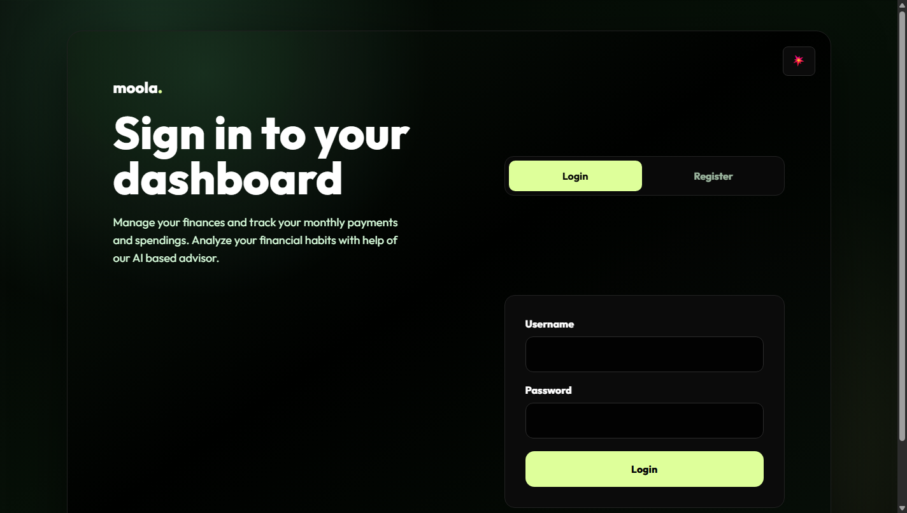
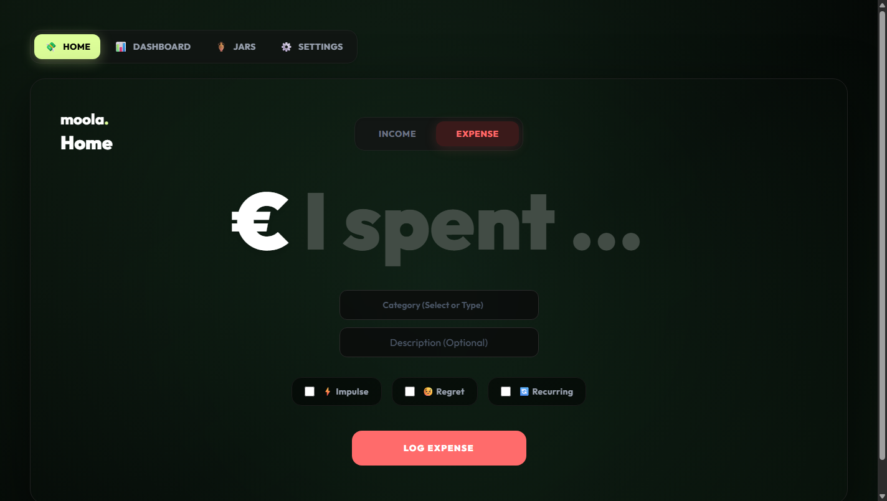
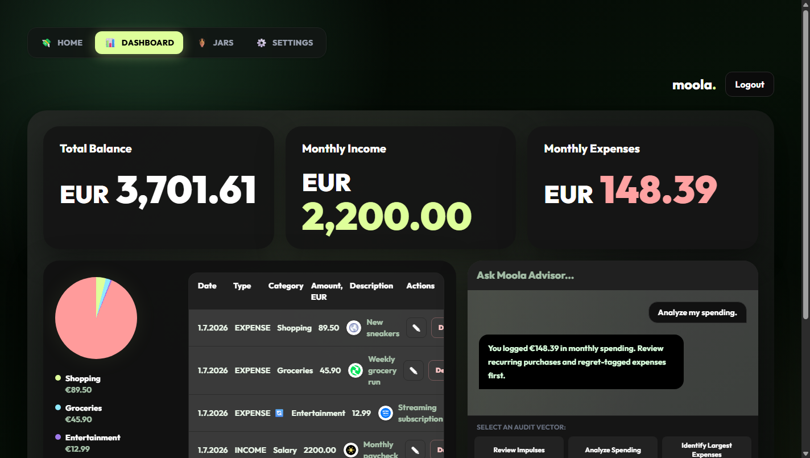
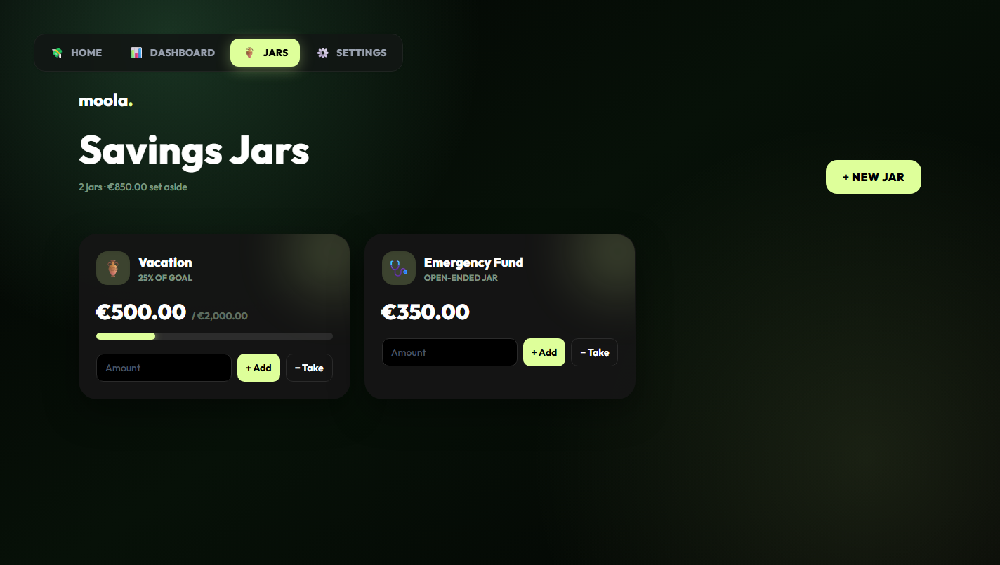
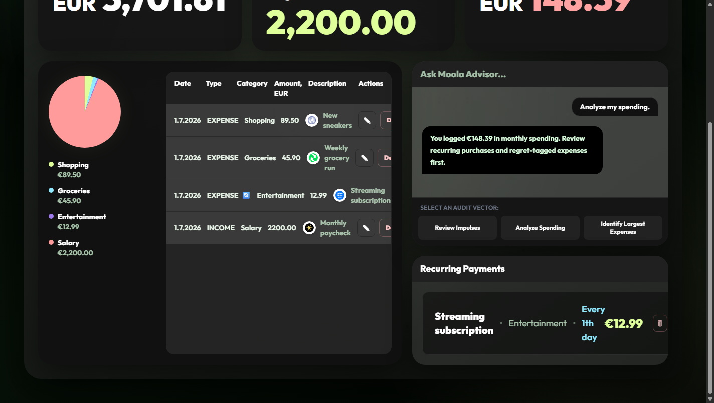

# Moola

A personal finance tracker with a twist: instead of just logging transactions, Moola translates
spending into hours of work, tags purchases by *how you felt* about them, and has an AI advisor
that will either roast your coffee habit or talk you down from it, your choice.

**Stack:** Spring Boot 4 (Java 17) · React 19 + Vite · Tailwind CSS · MySQL · JWT auth

---

## Screenshots

| | |
|---|---|
|  |  |
|  |  |

<details>
<summary>AI advisor + recurring payments</summary>



</details>

## Features

- **Time/Money Translator** — every purchase can be shown as "X hours of your life" instead of a
  currency amount, calculated from your hourly wage.
- **Behavioral Tagging** — mark transactions as *Impulse Buy* or *Regret* to see patterns in how
  you spend, not just what you spend.
- **AI Financial Advisor** — sends your recent transaction history to an LLM (via Groq) and gets
  back short, tone-adjustable feedback: brutally honest ("roast") or calm and encouraging ("zen").
- **Safe-to-Spend** — a running balance that subtracts recurring bills so you know what's actually
  free to spend today.
- **Salary Shield** — a privacy toggle that hides absolute currency amounts and shows everything
  in hours worked instead.
- **Multi-currency** — log transactions in any currency; live conversion rates come from the
  [Frankfurter API](https://frankfurter.dev), and switching your preferred currency retroactively
  re-prices your wallet and transaction history.
- **Savings Jars** — set money aside for specific goals (a laptop, a trip, an emergency fund).
  Depositing into a jar actually moves money out of your spendable balance, like Monzo pots; each
  jar tracks progress toward an optional target and refunds itself back to your balance if deleted.
- **Custom categories** with per-user colors, resolved automatically by name or id.
- **Admin panel** for user management, gated behind a real `ROLE_ADMIN` JWT claim.

## Tech stack

| Layer     | Technology                                                                 |
|-----------|-----------------------------------------------------------------------------|
| Backend   | Spring Boot 4.0.3, Java 17, Spring Security, Spring Data JPA, MySQL         |
| Auth      | Stateless JWT (io.jsonwebtoken), BCrypt password hashing, role-based access |
| Frontend  | React 19, Vite, Tailwind CSS 4                                              |
| External  | [Groq](https://groq.com) (AI advice), [Frankfurter](https://frankfurter.dev) (FX rates) |
| Docs      | springdoc-openapi (Swagger UI)                                             |

## Architecture

```
frontend/   React SPA (Vite dev server proxies /api -> localhost:8081)
backend/    Spring Boot REST API (stateless, JWT-secured, MySQL-backed)
```

The frontend never talks to MySQL, Groq, or Frankfurter directly — every external call is
proxied through the backend, which holds the actual credentials.

## Getting started

### Run with Docker (fastest)

Requires only [Docker](https://www.docker.com/products/docker-desktop/) (with Compose v2, bundled
by default). The whole stack — MySQL, backend, frontend — comes up with one command:

```bash
docker compose up --build
```

- Frontend: [http://localhost:5173](http://localhost:5173)
- Backend: [http://localhost:8081](http://localhost:8081) (Swagger at `/swagger-ui/index.html`)

No `.env` file is required — sensible local-dev defaults are baked into `docker-compose.yml`
(including a MySQL database and a JWT secret long enough for HS256). If you want real AI advice
from Groq, copy [.env.example](.env.example) to `.env` and set `GROQ_KEY`; everything else works
without it.

Other useful commands:

```bash
docker compose up -d          # same, but detached (runs in the background)
docker compose logs -f backend
docker compose up --build     # rebuild after pulling code changes
docker compose down           # stop everything, keep the database
docker compose down -v        # stop everything and wipe the database
```

### Run natively (for development)

#### Prerequisites

- JDK 17+
- Maven (or use an IDE with a bundled Maven, e.g. IntelliJ)
- Node.js 18+
- A MySQL database (local, Docker, or a managed instance like Aiven/PlanetScale)

#### Backend

```bash
cd backend
cp .env.example .env   # fill in DB credentials, JWT secret, and API keys
mvn spring-boot:run
```

`.env` is loaded automatically via `spring-dotenv` — see [.env.example](backend/.env.example) for
every variable the app reads. At minimum you need a MySQL connection string and a `JWT_SECRET`;
`GROQ_KEY` is only required if you want the AI advisor to return real responses (it degrades
gracefully to a placeholder message without one).

The backend starts on `http://localhost:8081`. Interactive API docs are at
[`/swagger-ui/index.html`](http://localhost:8081/swagger-ui/index.html).

Run the test suite with:

```bash
mvn test
```

#### Frontend

```bash
cd frontend
npm install
npm run dev
```

The dev server runs on `http://localhost:5173` and proxies `/api/*` to the backend, so no CORS
configuration is needed locally.

### Admin access

Registration always creates a plain `USER` account — there's no self-service way to become an
admin, by design. To reach `/admin`, manually set a user's `role` column to `ADMIN` in the
database, then log in normally through the app; the admin panel checks the role embedded in your
JWT.

## Security notes

- Passwords are hashed with BCrypt; JWTs are short-lived and signed with HS256.
- Every resource endpoint resolves "who am I" from the authenticated JWT's subject — never from a
  client-supplied id or username in the request body.
- `/api/admin/**` requires a `ROLE_ADMIN` authority derived from the JWT, not a shared password.
- External API failures (Frankfurter, Groq) are logged server-side and degrade to safe fallback
  behavior instead of surfacing raw exception details to the client.

## Project structure

```
backend/src/main/java/com/moola/backend/
  controllers/   REST endpoints
  services/      business logic (wallet math, currency conversion, AI prompts)
  models/        JPA entities
  repositories/  Spring Data repositories
  security/      JWT filter, JWT utils, global exception handling
  config/        Spring Security / CORS configuration

frontend/src/
  components/    auth, dashboard, and shared UI components
  services/      fetch-based API client
  utils/         session persistence helpers
  constants/     shared constants

docker-compose.yml    wires mysql + backend + frontend together
backend/Dockerfile    Maven build -> slim JRE runtime
frontend/Dockerfile   Vite build -> nginx static serve
frontend/nginx.conf   reverse-proxies /api/* to the backend container
```
